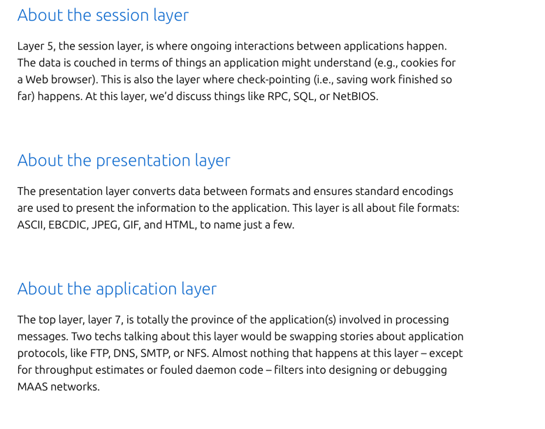

# Technology Exam Notes

## Install docker for linux

Opdater package listen, hvilket er relevant når ny
software skal installeres for at sikre nyeste version.
```bash
sudo apt-get update
```

Docker har et script der kan køres 
for at få Docker installed.

```bash
curl -fsSL https://get.docker.com -o get-docker.sh
```

Herefter køres scriptet lokalt:
```bash
sudo sh get-docker.sh
```

<br>

---

## Docker Steerings

Kør en simpel ubuntu docker container:
```bash
docker run -it ubuntu
```

Build an image from given docker file in pwd:
```bash 
docker build -t [navn] .
```

<br>

---

## MYSQL docker container

Kør en mysql container:
```bash
docker run --name Test --restart unless-stopped -p 3306:3306 -e MYSQL_ROOT_PASSWORD=test -d mysql
```

herefter skabes adgang til mysql serveren ved følgende:
```bash
docker exec -it Test bash
mysql -uroot -p
```

<br>

---

# CLI Commands For Various Stuff

Install nano for linux:
```bash
apt update
```
```bash
apt install nano
```

### Understanding Linux Permissions and `chmod`

When dealing with Linux file permissions, 
the `chmod` command is used to manage access rights. 
Organized into three 
categories: user (`u`), group (`g`), 
and others (`o`). 
The permissions themselves are represented by `r` 
(Read), `w` (Write), and `x` (Execute).

### Numeric Representation of Permissions:

- `r` (Read) is represented by the number `4`.
- `w` (Write) is represented by the number `2`.
- `x` (Execute) is represented by the number `1`.

#### Examples:

#### Make a File Executable for Everyone:

To add execute permission for the 
owner, group, and others:
```bash
chmod +x filename
```

For only group and other:
```bash
chmod go+x filename
```

lsof lists open network connections and the 
associated processes on your system.
It can help identify higher layer 
protocols and services running on specific ports. 
Protocols such as HTTP, FTP, SSH, or 
DNS operate at the Application layer (Layer 7) 
of the OSI model.
```bash
sudo lsof -i
```

<br>

---
# OSI Model



